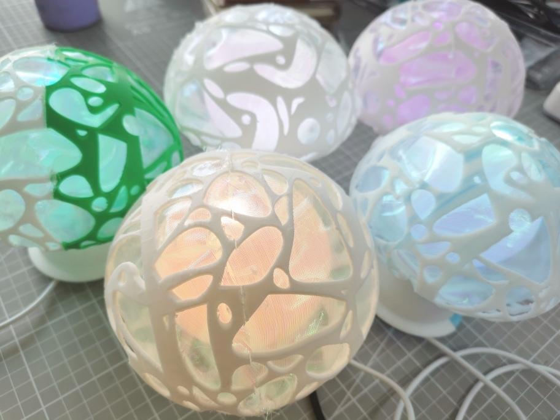

# 天气蘑菇 · アマキノコ · Amakinoko

一个蘑菇外形的彩灯装置，流动的颜色依天气变化。通过 USB 连接电脑，也可以自行定制光效。

## 食谱

材料
- 3D 打印外壳元件
- 炫彩纱布（？）
- WS2812/WS2812B 灯带（5050 灯珠；每米 96 灯，取 24 灯）
- 2.54 mm 排针
- 2.54 mm 跳线（杜邦线），双端孔头
- 组装电路板（PCBA）
- 胶水，如 UHU 胶
- （可选）热熔胶
- （可选）镀银纱线

步骤
1. 将纱布用胶水粘贴在两片外壳上；
2. 将 3 pin 排针焊接在灯带首端；
3. 将灯带打结成球状，尽可能使每一个朝向都有小灯；
4. 将灯带上的排针插入杜邦线，连接至电路板；
5. 将灯带与杜邦线固定在内胆内侧（可用胶水或热熔胶），保持灯带悬空在中央位置；
6. （可选）若有镀银纱线，可将其随意粘贴在外壳内壁，另一端穿过电路板上的触摸传感孔，打结、粘贴固定；
7. 将外壳与内胆粘贴固定；
8. 连接 USB 电源即可。

注：3D 打印与 PCBA 的组装未列入。PCBA 组装可参考 KiCad 工程文件；完成后通过 DAP 调试器向 STM32 微控制器写入程序，再通过 Amakinoko 配置工具写入灯光程序。

## 定制灯光

灯光程序运行在 Mumu 虚拟机中，目前可以通过 Mumu 汇编语言撰写。（文档待补全，暂时可参考现有的程序。）

## 目录组织
- **hw/**: 印刷电路板工程文件
- **fw/**: STM32 微控制器固件源程序
- **cfg/**: PC 配置工具软件源程序
- **releases/**: 3D 打印模型、向印刷电路板厂家提交的 Gerber 图纸，以及作为释出版本的固件机器码

部分文件可以通过以下软件打开（版本号作为参考）：
- 打印零件：3D One
- 电路板：KiCad (7.0.10)
- 固件：Arm GNU Toolchain (GCC 10.3.1), STM32CubeG0 (1.5.0), PlatformIO (6.1.16)

## 许可

本仓库内的所有内容按照 CERN-OHL-S（CERN 开放硬件许可证第 2 版，强互惠条件）分发。完整原文参见 **COPYING.txt** 或[在线访问](https://ohwr.org/cern_ohl_s_v2.txt)。
